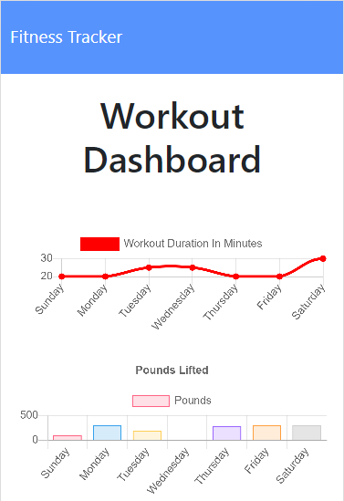

# Fitness Tracker
This is a node.js express web-server that serves a fitness app you can use to track your workouts. Data is stored with MongoDB via the mongoose node module.

## Technologies Used
- Node.js
- Express.js
- MongoDB
- Chart.js

## Demo
The app can be viewed [here](https://bdfitness.herokuapp.com).

